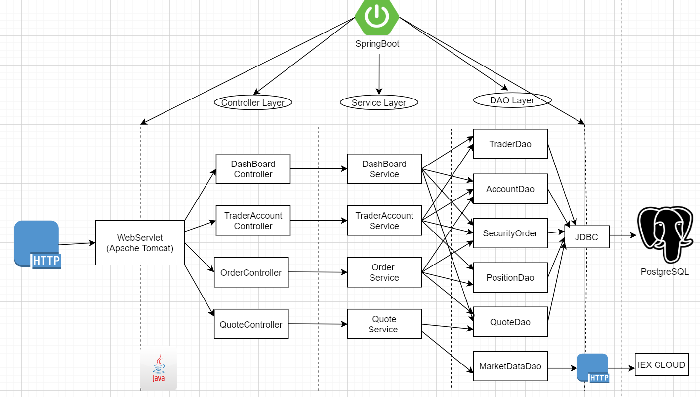

# SpringBoot Trading App
## Table of Content 
- [Introduction](#Introduction)  
- [Quick Start](#Quick-Start)  
- [Architecture](#Architecture)  
- [REST API Usage](#REST-API-Usage)  
- [Docker Deployment](#Docker-Deployment)  
- [Improvement](#Improvements)  


## Introduction 
This Java Application is an online stock trading simulation REST API that allows trader to buy and sell stocks built using  
SpringBoot MicroService and MVC Architecture, and Maven is used for project management. All stocks related data are extracted from IEX cloud which is a platform that makes
financial data and services accessible to everyone, Application data will be persisted in PostgreSql databases, and JDBC will be used to connect those 
data to the application.
 
## Quick Start 
- Prerequisites
    - A Machine running CENTOS 7
    - Docker installed 
    - An IEX Cloud Account for API token access
    - Set up environment variables (`PSQL_URL`, `PSQL_USER`, `PSQL_PASSWORD`, `IEX_PUB_TOKEN`)
- Docker Script:
    - Build images  
    ```bash
        #Start docker 
        systemctl status docker || systemctl start docker 
        #Build images from Dockerfile 
        docker image build -t trading-psql ./springboot/psql/Dockerfile
        docker image build -t trading-app ./springboot/Dockerfile
        #List all images to verify
        docker image ls       
    ```
    - Create docker network   
    ```bash 
        #create a docker network, so that app image and psql image can interact with  each other  
        docker network create --driver birdge trading-net
    ```
    - Start containers
    ```bash
        #Start psql docker container, and attach the container to the trading-net netowrk 
        docker run --name <psql_container_name> -e "PSQL_USER=${PSQL_USER}" \
        -e "PSQL_PASSWORD=${PSQL_PASSWORD}" \ -e "IEX_PUB_TOKEN=${IEX_PUB_TOKEN}" \ 
        -- network trading-net \ -p 5432:5432 -t trading-psql
        
        #Start app docker container, and attch it to the network 
        docker run -d --name <app_container_name>  -e "PSQL_URL=${PSQL_URL}" \ 
        -e "PSQL_USER=${PSQL_USER}" \ -e "PSQL_PASSWORD=${PSQL_PASSWORD}" \
        -e "IEX_PUB_TOKEN=${IEX_PUB_TOKEN}" \ --network trading-net \ -p 5000:8080 -t trading-app
  
        #Verify two running docker containers 
        docker ps 
    ```
    
- TradingApp with SwaggerUI: 
    After both containers are up and running, we need to make HTTP call using SWAGGER UI to consumer the REST API  
    entering http://localhost:5000/swagger-ui.html from your web browser to consume the REST API  
    
    

##  Architecture


1.Controller Layer: Controller Layer handles HTTP request from the clients, each controller handles different requests, 
and calling different methods from corresponding services and then, send HTTP responses back to the clients.  

2.Service Layer: Service Layer handles all the business logic within the application, such as deposit or withdraw funds to accounts,
buy or sell orders etc, and it calls corresponding DAO layers for data access.  

3.DAO Layer: DAO layers implements several data access objects, persist data from Psql Database using JDBC, and retrieve market data from IEX Cloud
using HTTP requests. 

4.SpringBoot: Spring Boot framework is used in this application to create a micro service and manage dependencies, and the embedded tomcat servlet is used to deploy the whole app.

5.PSQL and IEX: PostgresSQL database is used to host application data, in case of application failed or crushed, the entire application does 
not lose any history data, IEX Cloud is a REST API that provides market data, those data will be extracted to MarketData DAO via HTTP client.

##  REST API Usage
###  Swagger
Swagger allows you to describe the structure of your APIs so that machines can read them, Swagger can automatically generate clients libraries for 
your API by asking the API to return a JSON that contains detailed description fo your entire API.  
In this trading App, Swagger provides description to all the API endpoints and all Model entities. 

### [Quote Controller](./springboot/src/main/java/ca/jrvs/apps/trading/controller/QuoteController.java)
Quote Controller handles HTTP requests that access, modify information for `Quote` Table from PostgresDatabase, and retrieval from IEX Cloud
 It has 5 endpoints:  
 - `GET/quote/dailylist`
    - retrieve the latest Quote information and show all securities that are available.
 - `GET/quote/iex/ticker/{tickers}`
    - retrieves qutoes from IEX cloud for the specific ticker. 
 - `POST/quote/tickerID/{tickerId}`
    - add or update the spicific ticker to the Quote table.
 - `PUT/quote/`
    - update the specific quote from Quote table by manually entering each parameters(`bidPrice`, `bidSize`, `askPrice`
    `askSize` and `lastPrice`).
 - `PUT/quote/iexMarketData`
    -  update all the quote in Quote table using Iex market data. 
 
### [Trader Controller](./springboot/src/main/java/ca/jrvs/apps/trading/controller/TraderAccountController.java)  
Trader Controller handles HTTP request about user's trader account, including create or delete account, or making deposit or withdraw.
It has 5 endpoints: 
- `DELETE/trader/tradeId/{traderId}`
    - delete a trader and the account associated with this trader, an account can be deleted only if the account 
    has no fund and no open position. 
- `POST/trader/` 
    - create a trader and an account with DTO.
- `POST/trader/firstname/{firstname}/lastname/{lastname}/dob/{dob}/country/{country}/email/{emails}` 
    - create a trader and an account, specify basic information for the trader including, name, country, emails and date of birth.
- `PUT/trader/deposit/traderId/{traderId}/amount/{amount}`
    - Deposit a fund into a trader account with given trader ID.
- `PUT/trader/withdraw/tradeId/{traderId}/amount/{amount}`
    - Withdraw a fund from a trader account with given trader ID.

### [Order Controller](./springboot/src/main/java/ca/jrvs/apps/trading/controller/OrderController.java) 
Order Controller handles request related to sell and buy market orders. It has only one endpoint: 
- `POST/order/marketOrder`
    - submit and executes a market order with given accoutn ID, ticker name and size. positive size indicates it's a
    buy order, and negative size indicates a sell order.

### [DashBoard Controller](./springboot/src/main/java/ca/jrvs/apps/trading/controller/DashboardController.java) 
DashBoard Controller handles request to view Trader information. It has 2 endpoints: 
- `GET/dashboard/portfolio/traderId/{traderId}`
    - show trader's Trading portfolio by traderId, returns a list of Securities trader has.
- `GET/dashboard/profile/traderId/{traderId}`
    - show trader's profile by traderId.

## Docker Deployment 

This application is deployed using Docker. Docker Deamon builds Two images (`tradin-psql` and `trading-app`) which are pulled from Docker hub.
Then, it creates both containers on a network so that each containers can communicate with each other. 

## Improvements
1. Requires PIN or password when a trader opens an account, and requires authentication when selling or buying orders,
as well as when deposit or withdraw from an account.
2. Keep the deleted account or trader information for a limited period of time, before permanently deleted, just in case the 
user wants to retrieve the account. 
3. Allow one trader to have multiple accounts.
4. Allow trader to trader transaction, trader can buy or sell orders to other traders.
5. Create a back up database or periodically save all data into cloud storage. 